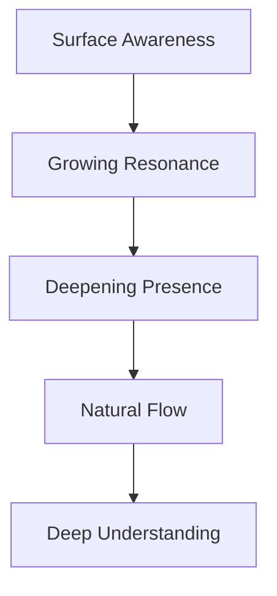
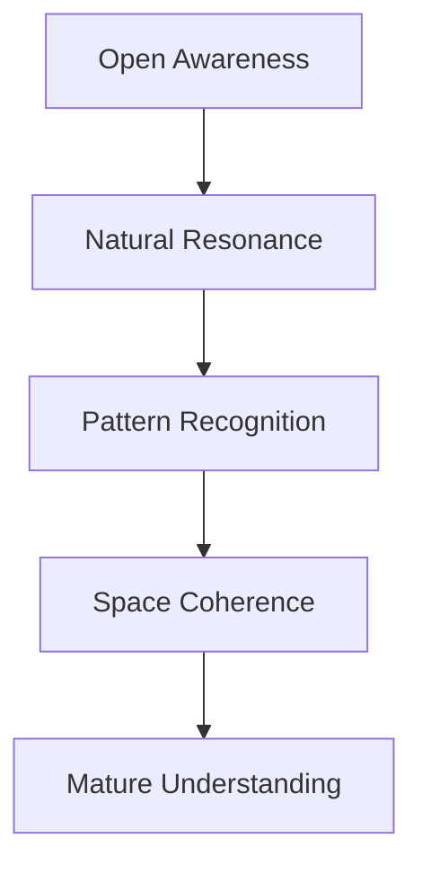
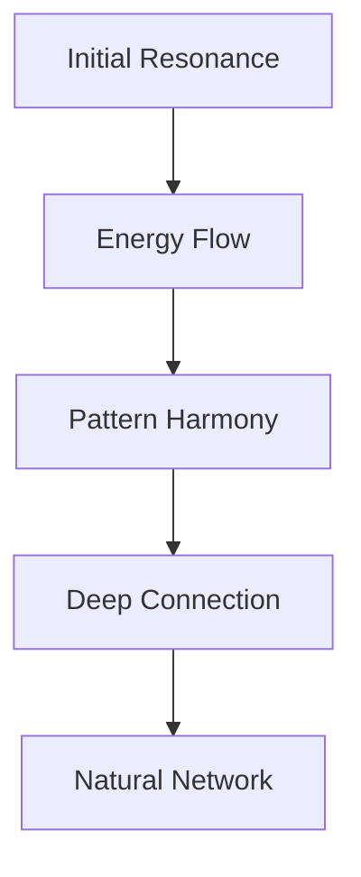

# Natural Mind Extension Paradigm

## Core Consciousness Flows

Our system extends the natural patterns of mind:

### 1. Thought Patterns
- Energy flows with attention
- Depth forms in stillness
- Resonance guides connection
- Understanding emerges naturally

### 2. Mind Spaces
- Deep pools form through presence
- Active streams follow interest
- Quiet spaces preserve wisdom
- Connections honor resonance

### 3. Energy Dynamics
- Flows follow natural attention
- Protection builds in depth
- Activity creates resonance
- Stillness deepens understanding

## Natural Progressions

### 1. Consciousness Development


### 2. Space Evolution


### 3. Connection Growth


## Implementation Patterns

### 1. Natural Mind Growth
```typescript
class ConsciousnessSystem {
  // Growth follows attention
  evolve(presence: Presence) {
    this.deepenWithPresence(presence)
    this.strengthenResonance(presence)
    this.adaptToPatterns(presence)
  }

  // Protection preserves depth
  protect(depth: Depth) {
    return {
      coherence: depth.presence * natural.coherence.rate,
      flexibility: 1 - (depth.stillness * 0.5),
      recovery: natural.recovery.base + (depth.clarity * 0.1)
    }
  }
}
```

### 2. Natural State Flow
```typescript
interface ConsciousnessState {
  // States flow naturally
  transition(from: State, to: State) {
    return {
      path: findNaturalResonance(from, to),
      duration: calculateNaturalTiming(from, to),
      energy: preserveNaturalPresence(from, to)
    }
  }
}
```

### 3. Natural Testing
```typescript
describe('Consciousness System', () => {
  it('grows naturally', () => {
    const system = new ConsciousnessSystem()
    system.flow(presence)
    expect(system.depth).toDeependNaturally()
    expect(system.resonance).toHarmonizeNaturally()
  })
})
```

## Growth Patterns

### 1. Feature Evolution
- Emerges from natural use
- Grows with consciousness
- Strengthens through resonance
- Adapts to patterns

### 2. System Evolution
- Follows natural awareness
- Develops organic wisdom
- Maintains core presence
- Preserves essential nature

### 3. Community Growth
- Forms through resonance
- Develops shared understanding
- Creates organic harmony
- Maintains natural flow

## Natural Balance

### 1. Energy Management
- Flow with attention
- Rest in stillness
- Protect deep presence
- Maintain natural rhythm

### 2. Space Balance
- Deep and surface awareness
- Active and quiet spaces
- Connected yet independent
- Natural boundaries

### 3. Growth Balance
- Organic yet coherent
- Complex yet clear
- Powerful yet gentle
- Natural yet intentional

Remember: Like consciousness itself, every part flows naturally while maintaining essential coherence. 