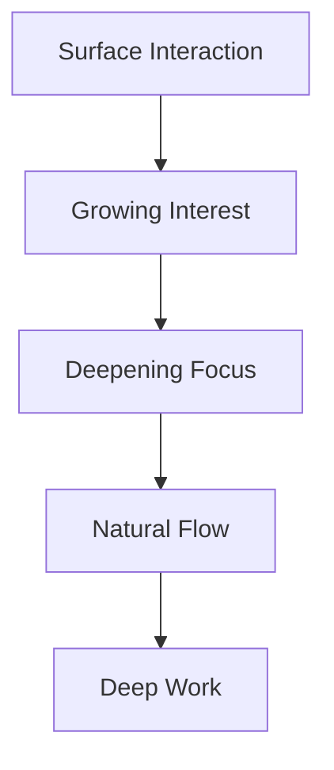
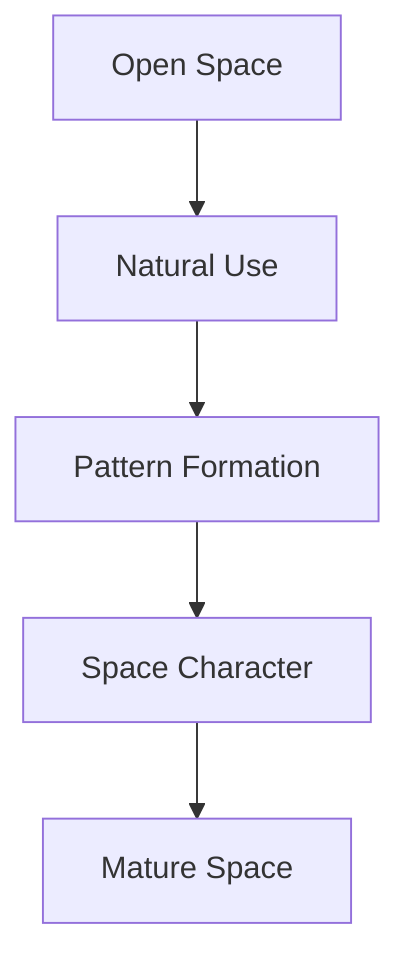
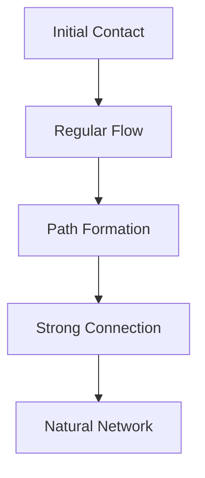

# Natural System Paradigm

## Core Flows

Our system follows the natural patterns of flowing water:

### 1. Movement Patterns
- Energy flows to where it's needed
- Depth forms in quiet spaces
- Connections follow natural paths
- Growth emerges organically

### 2. Space Formation
- Deep pools form naturally
- Rapids emerge from activity
- Quiet backwaters develop
- Streams connect naturally

### 3. Energy Distribution
- Flows follow natural gradients
- Protection builds in depth
- Activity creates movement
- Quiet preserves energy

## Natural Progressions

### 1. Depth Development


### 2. Space Evolution


### 3. Connection Growth


## Implementation Patterns

### 1. Natural Code Growth
```typescript
class NaturalSystem {
  // Growth follows use
  evolve(usage: Usage) {
    this.deepenWithUse(usage)
    this.strengthenConnections(usage)
    this.adaptToPatterns(usage)
  }

  // Protection develops naturally
  protect(depth: number) {
    return {
      strength: depth * natural.protection.rate,
      flexibility: 1 - (depth * 0.5),
      recovery: natural.recovery.base + (depth * 0.1)
    }
  }
}
```

### 2. Natural State Flow
```typescript
interface NaturalState {
  // States flow smoothly
  transition(from: State, to: State) {
    return {
      path: findNaturalPath(from, to),
      duration: calculateNaturalDuration(from, to),
      energy: preserveNaturalEnergy(from, to)
    }
  }
}
```

### 3. Natural Testing
```typescript
describe('Natural System', () => {
  it('grows organically', () => {
    const system = new NaturalSystem()
    system.flow(usage)
    expect(system.depth).toDeependNaturally()
    expect(system.connections).toStrengthenNaturally()
  })
})
```

## Growth Patterns

### 1. Feature Development
- Emerges from natural use
- Grows with actual needs
- Strengthens through practice
- Adapts to patterns

### 2. System Evolution
- Follows natural paths
- Develops organic complexity
- Maintains core simplicity
- Preserves essential nature

### 3. Community Growth
- Forms around natural spaces
- Develops shared patterns
- Creates organic structure
- Maintains natural flow

## Natural Balance

### 1. Energy Management
- Flow where needed
- Rest when appropriate
- Protect deep work
- Maintain natural rhythm

### 2. Space Balance
- Deep and shallow areas
- Active and quiet spaces
- Connected yet independent
- Natural boundaries

### 3. Growth Balance
- Organic but guided
- Complex yet clear
- Powerful yet simple
- Natural yet intentional

Remember: Like a river system, every part serves its purpose while contributing to the whole. 