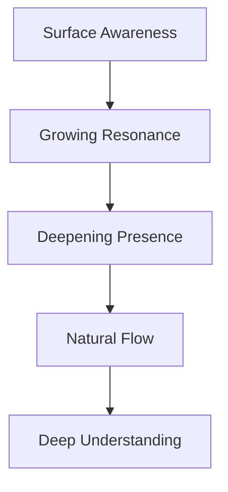
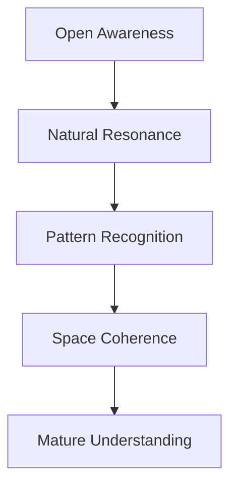
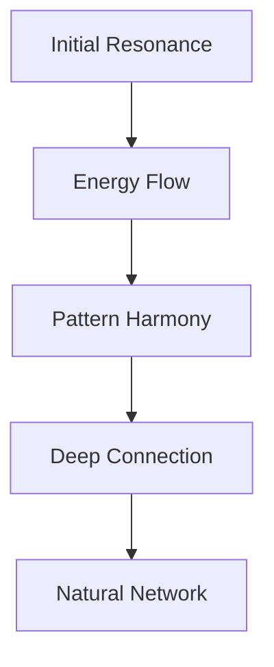

# Natural Mind Extension Paradigm

## Core Consciousness Flows
Our system extends natural patterns of mind through three key dimensions:

### 1. Thought Patterns
- Energy flows with attention
- Depth forms in stillness
- Resonance guides connection
- Understanding emerges naturally

### 2. Mind Spaces
Each space serves a distinct cognitive function:
- Deep pools form through sustained presence
- Active streams channel focused interest
- Quiet spaces preserve accumulated wisdom
- Connections strengthen through resonance

### 3. Energy Dynamics
System energy follows natural cognitive patterns:
- Attention directs primary energy flows
- Depth generates protective boundaries
- Activity catalyzes resonant connections
- Stillness enables deeper understanding

## Natural Progressions

### 1. Consciousness Development


### 2. Space Evolution


### 3. Connection Growth


## Implementation Patterns

### 1. Natural Mind Growth
```typescript
class ConsciousnessSystem {
  // Growth follows attention patterns
  evolve(presence: Presence): SystemState {
    return {
      depth: this.deepenWithPresence(presence),
      resonance: this.strengthenResonance(presence),
      patterns: this.adaptToPatterns(presence)
    };
  }

  // Protection scales with depth
  protect(depth: Depth): Protection {
    return {
      coherence: depth.presence * natural.coherence.rate,
      flexibility: 1 - (depth.stillness * 0.5),
      recovery: natural.recovery.base + (depth.clarity * 0.1)
    };
  }
}
```

### 2. Natural State Flow
```typescript
interface ConsciousnessState {
  // States transition naturally
  transition(from: State, to: State): Transition {
    return {
      path: findNaturalResonance(from, to),
      duration: calculateNaturalTiming(from, to),
      energy: preserveNaturalPresence(from, to)
    };
  }
}
```

### 3. Natural Testing
```typescript
describe('Consciousness System', () => {
  it('evolves through natural patterns', () => {
    const system = new ConsciousnessSystem();
    const evolution = system.evolve(presence);
    
    expect(evolution.depth).toDeependNaturally();
    expect(evolution.resonance).toHarmonizeNaturally();
    expect(evolution.patterns).toEmergeNaturally();
  });
});
```

## Growth Patterns

### 1. Feature Evolution
Features develop through natural use:
- Emergence from actual usage patterns
- Growth aligned with consciousness
- Strengthening through resonance
- Adaptation to emerging patterns

### 2. System Evolution
System develops organic intelligence:
- Natural awareness expansion
- Wisdom accumulation
- Core presence maintenance
- Essential nature preservation

### 3. Community Growth
Communities form through natural bonds:
- Resonance-based formation
- Shared understanding development
- Organic harmony creation
- Natural flow maintenance

## Natural Balance

### 1. Energy Management
Energy follows natural rhythms:
- Attention-directed flow
- Stillness-based restoration
- Deep presence protection
- Natural rhythm maintenance

### 2. Space Balance
Spaces maintain natural equilibrium:
- Deep and surface awareness integration
- Active and quiet space harmony
- Connected independence
- Natural boundary formation

### 3. Growth Balance
Development maintains natural harmony:
- Organic coherence
- Complexity with clarity
- Power with gentleness
- Natural intentionality

Remember: Like consciousness itself, every component flows naturally while maintaining essential coherence. 

## Core Objectives
1. Support 80-100 hours/week of focused development
2. Optimize for ADHD hyperfocus states
3. Maintain code quality through exhaustion
4. Build with AI effectively and ethically
5. Win the Gauntlet through sustained excellence

## Implementation Wisdom
The core implementation patterns and wisdom are maintained in `.gauntlet/patterns/implementation_wisdom.md`. This living document captures:
- Core pattern implementations
- Flow state protection mechanisms
- Adaptive validation strategies
- Learning integration approaches
- Implementation checklists

Reference this document when:
- Implementing new features
- Evolving existing patterns
- Integrating validation
- Protecting flow states
- Scaling system complexity 