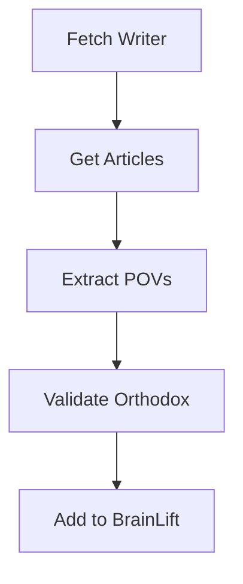

# Substack Web Integration Spec 🌐

## Core Capabilities Needed 🎯

### 1. Substack API Integration
```python
ENDPOINTS = {
    "user_profile": "/api/v1/user/{username}",
    "user_posts": "/api/v1/user/{username}/posts",
    "user_following": "/api/v1/user/{username}/following",
    "user_followers": "/api/v1/user/{username}/followers"
}
```

### 2. Required Functions
```python
FUNCTIONS = {
    "fetch_writer": "Get writer profile and metadata",
    "fetch_articles": "Get all articles by writer",
    "fetch_network": "Get writer's connections",
    "extract_povs": "Parse articles for SpikyPOVs",
    "analyze_connections": "Find common connections"
}
```

### 3. Data Structures
```python
class SubstackWriter:
    username: str
    profile_url: str
    articles: List[Article]
    connections: List[str]
    domains: List[str]

class Article:
    title: str
    content: str
    date: datetime
    spiky_povs: List[SpikyPOV]
    domains: List[str]
```

## Implementation Plan 📋

### Phase 1: Basic Fetching
1. Writer profile fetching
2. Article list retrieval
3. Content extraction
4. Basic error handling

### Phase 2: Network Analysis
1. Following/follower mapping
2. Connection graph building
3. Common connection detection
4. Influence analysis

### Phase 3: Content Analysis
1. SpikyPOV extraction
2. Domain categorization
3. Cross-reference system
4. Orthodox validation

## Integration with BrainLift 🔄

### Data Flow


### Storage Structure
```python
STORAGE = {
    "writers": "/brainlifts/dissident-wisdom/02-WRITERS/",
    "articles": "/brainlifts/dissident-wisdom/03-DOMAINS/",
    "povs": "/brainlifts/dissident-wisdom/04-SPIKYPOVS/"
}
```

## Required Tools 🛠️

### 1. Web Tools
- HTTP client
- HTML parser
- JSON processor
- Rate limiter

### 2. Analysis Tools
- NLP for content analysis
- Graph DB for connections
- Vector DB for similarity

### 3. Integration Tools
- File system interface
- Data validators
- Orthodox alignment checker

## Usage Examples 📝

### Basic Usage
```python
# Fetch writer
writer = fetch_writer("curtis_yarvin")

# Get all articles
articles = fetch_articles(writer)

# Extract POVs
povs = extract_povs(articles)

# Find common connections
network = analyze_connections([writer1, writer2, writer3])
```

### Advanced Usage
```python
# Full analysis pipeline
async def analyze_writer(username):
    writer = await fetch_writer(username)
    articles = await fetch_articles(writer)
    povs = await extract_povs(articles)
    validated = await validate_orthodox(povs)
    await add_to_brainlift(validated)
```

## Safety Measures 🚨

### 1. Rate Limiting
- Respect Substack API limits
- Implement backoff strategy
- Cache responses

### 2. Content Validation
- Verify Orthodox alignment
- Check content integrity
- Validate data formats

### 3. Error Handling
- Graceful degradation
- Retry mechanisms
- Error logging

## Next Steps 🚀

1. Set up basic HTTP client
2. Implement writer fetching
3. Build article parser
4. Create POV extractor
5. Add Orthodox validator

## Notes 📝

- Need to handle paywalled content
- Consider caching strategy
- Plan for API changes
- Document rate limits 