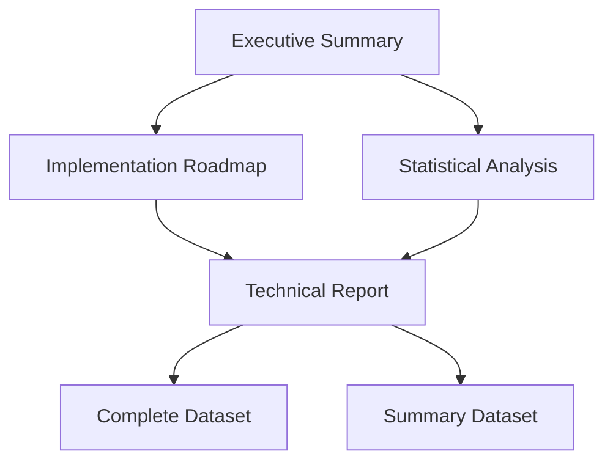

# Binti Security Assessment Deliverables

## Quick Navigation

### 1. For Executive Review
Start with these documents for a high-level understanding:

1. [Executive Summary](EXECUTIVE_SUMMARY.md)
   - Overview and business impact
   - Key findings and recommendations
   - Strategic roadmap

2. [Implementation Roadmap](IMPLEMENTATION_ROADMAP.md)
   - Timeline and resource planning
   - Cost-benefit analysis
   - Risk mitigation strategy

3. [Statistical Analysis](FINDINGS_STATISTICS.md)
   - Key metrics and trends
   - Risk distribution
   - Coverage analysis

### 2. For Technical Teams
Detailed technical documentation and findings:

1. [Technical Report](FINAL_findings_report_2024_01_04.md)
   - Detailed findings analysis
   - Technical recommendations
   - Implementation guidance

2. [Complete Dataset](FINAL_security_findings_2024_01_04.json)
   - Raw findings data
   - Evidence and reproduction steps
   - Detailed remediation steps

3. [Summary Dataset](FINAL_findings_summary_2024_01_04.json)
   - Aggregated findings data
   - Statistical breakdowns
   - Trend analysis

## Document Relationships

## Authors
- **Jon Dycaico** - Lead Security Analyst
- **claude-3.5-sonnet** - AI Analysis Assistant 