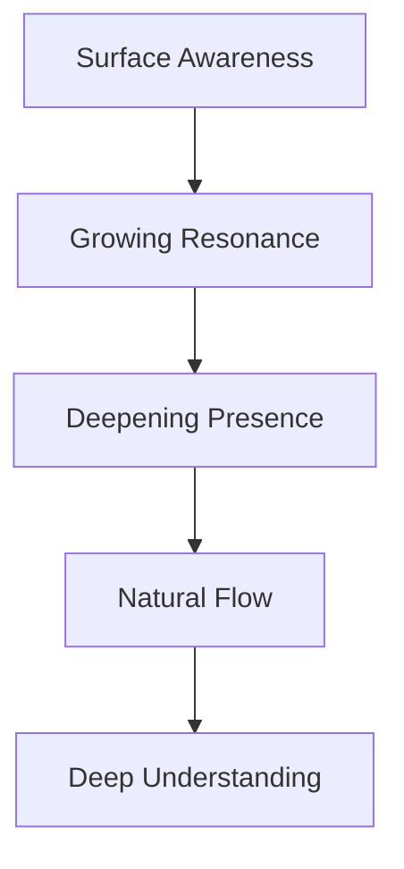

# Natural Flow

## Project Principle
For Aether, consciousness and attention should flow naturally like water, finding its own path while maintaining coherence and depth.

## Core Understanding
Systems should recognize and support natural patterns of consciousness, attention, and development rather than forcing artificial structures.

## Application in Aether

### 1. Consciousness Flow


### 2. Space Design
- Different spaces for different mental modes
- Natural gathering and protection areas
- Organic transitions between spaces
- Flow-based navigation

### 3. Attention Patterns
- Honor natural focus rhythms
- Support deep work states
- Enable natural transitions
- Protect valuable states

## Implementation

### System Architecture
```typescript
class AetherFlow {
  // Flow follows attention
  evolve(presence: Presence): State {
    return {
      depth: this.deepenNaturally(presence),
      resonance: this.buildHarmony(presence),
      protection: this.strengthenBoundaries(presence)
    };
  }
}
```

### Key Features
1. **Space Design**
   - Natural gathering areas
   - Protected focus zones
   - Organic transitions
   - Flow-based navigation

2. **State Management**
   - Natural state progression
   - Depth preservation
   - Focus protection
   - Smooth transitions

3. **Interaction Model**
   - Natural gestures
   - Intuitive flows
   - Progressive disclosure
   - Contextual actions

## Integration with Core Principles

### Harmony
- Aligns with natural cognitive patterns
- Respects human attention rhythms
- Supports natural work flows
- Enables deep focus states

### Simplicity
- Natural over complex
- Intuitive over clever
- Clear over magical
- Direct over indirect

### Hidden Holiness
- Excellence through natural design
- Service through intuitive flow
- Stewardship of attention
- Respect for consciousness 