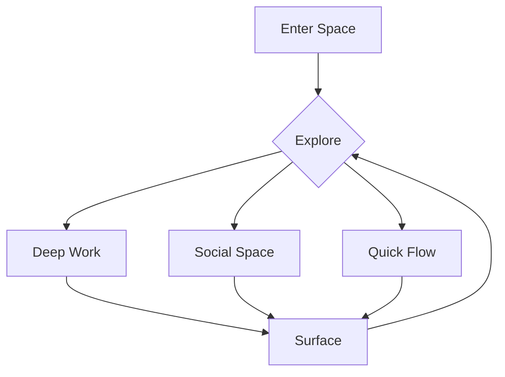

# Natural UX Patterns

## Core Experience Flows

### 1. Discovery Flow


### 2. Focus Patterns

#### Deepening Flow
- Gentle entry into focus
- Natural progression deeper
- Organic protection increases
- Smooth surface transitions

#### Visual Language
- Depth shown through subtle shadows
- Flow indicated by gentle movement
- Energy expressed through soft pulses
- Connections shown as natural paths

### 3. Interaction Models

#### Natural Movement
```typescript
interface Interaction {
  type: 'flow' | 'ripple' | 'surface' | 'dive'
  energy: number
  direction: Vector
  impact: Ripple
}

interface Ripple {
  strength: number
  spread: number
  duration: number
}
```

#### Touch Points
- Gentle transitions between states
- Organic response to interaction
- Natural feedback patterns
- Flowing state changes

### 4. Space Design

#### Deep Work Spaces
```
┌──────────────────────┐
│     Deep Pool        │
│  ╭─────────────╮    │
│  │  Focus Zone │    │
│  │            │    │
│  │            │    │
│  ╰─────────────╯    │
│                     │
└──────────────────────┘
```

#### Social Spaces
```
┌──────────────────────┐
│    Common Flow       │
│   ╭───╮  ╭───╮      │
│   │ A │──│ B │      │
│   ╰───╯  ╰───╯      │
│          ╭───╮      │
│          │ C │      │
│          ╰───╯      │
└──────────────────────┘
```

### 5. Flow States

#### Focus Flow
```css
.deep-focus {
  transition: all 0.5s ease;
  opacity: 0.9;
  filter: saturate(0.8);
}

.surface {
  transition: all 0.3s ease;
  opacity: 1;
  filter: saturate(1);
}
```

#### Energy Patterns
```css
.energy-flow {
  animation: pulse 2s infinite;
  transform-origin: center;
}

@keyframes pulse {
  0% { transform: scale(1); }
  50% { transform: scale(1.05); }
  100% { transform: scale(1); }
}
```

### 6. Natural Feedback

#### Visual Feedback
- Gentle ripples on interaction
- Smooth state transitions
- Organic loading patterns
- Natural error states

#### Sound Design
- Soft water sounds for actions
- Gentle tones for notifications
- Natural ambient background
- Calming transition sounds

### 7. Accessibility Patterns

#### Natural Navigation
- Clear paths through spaces
- Intuitive movement patterns
- Organic way-finding
- Natural landmarks

#### Universal Design
- Flows work for all abilities
- Natural alternative paths
- Organic adaptations
- Clear guidance always available

### 8. Implementation Examples

#### Space Transition
```typescript
function transitionSpace(from: Space, to: Space) {
  return {
    duration: calculateNaturalDuration(from, to),
    easing: 'cubic-bezier(0.4, 0, 0.2, 1)',
    properties: {
      opacity: [1, 0.5, 1],
      transform: ['scale(1)', 'scale(0.98)', 'scale(1)']
    }
  }
}
```

#### Focus Protection
```typescript
function protectFocus(depth: number) {
  return {
    blur: `${20 - depth * 2}px`,
    opacity: 0.1 + depth * 0.1,
    pointerEvents: depth > 0.7 ? 'none' : 'auto'
  }
}
```

### 9. Motion Design

#### Natural Movements
```css
.natural-motion {
  --flow-speed: 0.3s;
  --flow-ease: cubic-bezier(0.4, 0, 0.2, 1);
  
  transition: all var(--flow-speed) var(--flow-ease);
}

.depth-transition {
  transition-duration: calc(var(--flow-speed) * 2);
}
```

Remember: Every interaction should feel as natural as moving through water - smooth, responsive, and intuitive. 