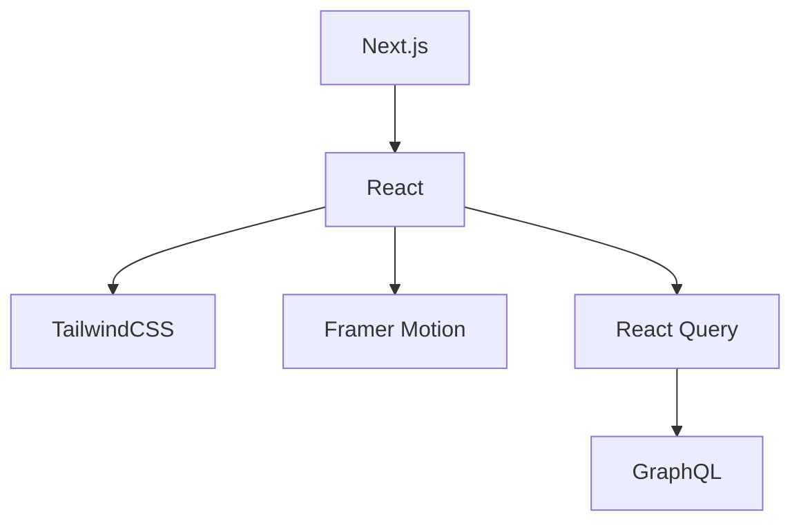
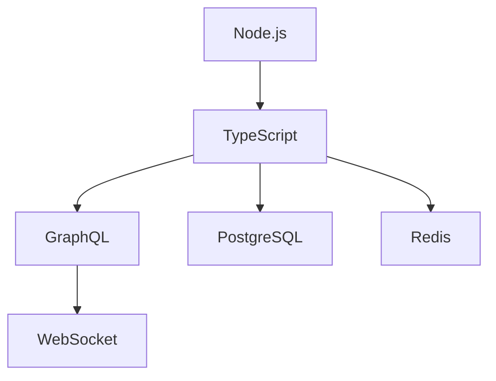

# Technical Implementation Guide

## Core Technology Choices

### Frontend Flow


### Backend Streams


## Natural Stack Integration

### 1. Frontend Patterns

#### Component Flow
```typescript
interface FlowComponent<P> {
  energy: number
  depth: number
  natural: {
    motion: MotionConfig
    transition: TransitionConfig
    protection: ProtectionConfig
  }
  render: (props: P) => JSX.Element
}

// Natural component creation
function createFlowComponent<P>(config: FlowConfig<P>): FlowComponent<P> {
  return {
    energy: config.initialEnergy,
    depth: config.initialDepth,
    natural: {
      motion: createNaturalMotion(config),
      transition: createNaturalTransition(config),
      protection: createNaturalProtection(config)
    },
    render: config.render
  }
}
```

#### State Management
```typescript
interface FlowState<T> {
  current: T
  depth: number
  energy: number
  transitions: Transition[]
}

function createFlowState<T>(initial: T): FlowState<T> {
  return {
    current: initial,
    depth: 0,
    energy: 1,
    transitions: []
  }
}
```

### 2. Backend Systems

#### Natural Data Flow
```typescript
interface DataStream<T> {
  source: StreamSource
  flow: FlowConfig
  transform: (data: T) => T
}

class NaturalDatabase {
  async flow<T>(stream: DataStream<T>) {
    const data = await this.source.read(stream.source)
    return stream.transform(data)
  }
}
```

#### Event Streams
```typescript
interface EventFlow {
  type: string
  energy: number
  payload: any
  natural: {
    source: string
    path: string[]
    depth: number
  }
}

class EventSystem {
  flow(event: EventFlow) {
    return this.streams
      .filter(s => this.naturalMatch(s, event))
      .map(s => this.processEvent(s, event))
  }
}
```

### 3. Integration Patterns

#### API Design
```graphql
type Space {
  id: ID!
  energy: Float!
  depth: Float!
  flow: Flow!
  connections: [Connection!]!
}

type Flow {
  direction: Direction!
  strength: Float!
  quality: Quality!
}

type Connection {
  source: Space!
  target: Space!
  strength: Float!
  type: ConnectionType!
}
```

#### WebSocket Flow
```typescript
interface WebSocketFlow {
  type: 'connect' | 'message' | 'disconnect'
  space: Space
  presence: Presence
  energy: number
}

class FlowSocket {
  handleFlow(flow: WebSocketFlow) {
    this.updateSpace(flow.space)
    this.adjustEnergy(flow.energy)
    this.notifyPresence(flow.presence)
  }
}
```

### 4. Natural Testing

#### Component Testing
```typescript
describe('Flow Component', () => {
  it('naturally adapts to energy changes', () => {
    const component = createFlowComponent(config)
    component.energy = 0.5
    expect(component.natural.motion).toAdaptNaturally()
  })
})
```

#### Integration Testing
```typescript
describe('System Flow', () => {
  it('maintains natural connections', async () => {
    const system = new FlowSystem()
    await system.connect(spaceA, spaceB)
    expect(system.connections).toFlowNaturally()
  })
})
```

### 5. Performance Patterns

#### Natural Loading
```typescript
interface LoadingFlow {
  initial: number
  rate: number
  pattern: 'wave' | 'ripple' | 'stream'
}

function createNaturalLoader(flow: LoadingFlow) {
  return {
    start: () => beginFlow(flow),
    progress: () => measureFlow(flow),
    complete: () => resolveFlow(flow)
  }
}
```

#### Optimization Flow
```typescript
interface OptimizationConfig {
  energy: {
    threshold: number
    recovery: number
  }
  depth: {
    max: number
    rate: number
  }
}

class NaturalOptimizer {
  optimize(config: OptimizationConfig) {
    this.balanceEnergy(config.energy)
    this.adjustDepth(config.depth)
  }
}
```

Remember: Technical implementations should flow as naturally as the experiences they create. 