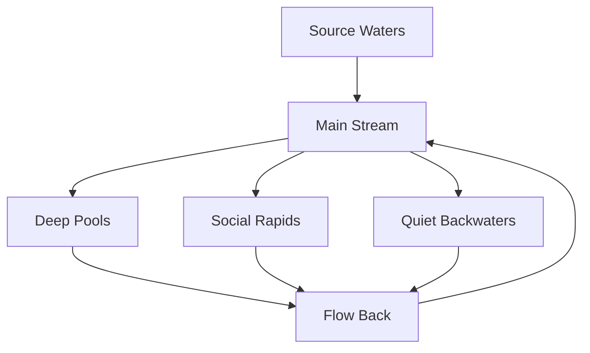
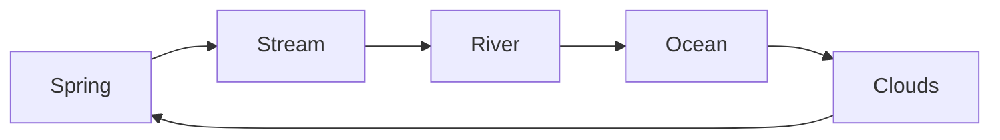

# System Flow Architecture

## Core Principles
Our system flows like a natural stream system:



## Natural Layers

### 1. Core Flow Layer
- **Space Dynamics**: Natural gathering and dispersal
- **Energy Systems**: Flow of activity and focus
- **Connection Patterns**: Organic linking of spaces
- **Depth Management**: Natural deepening of work

### 2. Human Layer
- **Presence**: Natural awareness of others
- **Interaction**: Organic collaboration patterns
- **Focus States**: Flow protection and enhancement
- **Energy Patterns**: Activity level management

### 3. Information Layer
- **Knowledge Streams**: Natural content organization
- **Idea Flows**: Organic thought connections
- **Discovery Paths**: Natural learning patterns
- **Context Pools**: Deep information gathering

### 4. Technical Implementation

```typescript
interface FlowSystem {
  spaces: Space[]
  streams: Stream[]
  pools: DeepPool[]
  connections: FlowConnection[]
}

interface Space {
  energy: number
  depth: number
  capacity: number
  currentFlow: Flow
}

interface Flow {
  direction: FlowDirection
  strength: number
  quality: FlowQuality
  participants: Presence[]
}
```

## Natural Patterns

### Space Formation
- Spaces form around natural gathering points
- Flow strength adapts to usage patterns
- Connections emerge from actual movement
- Depth develops through sustained attention

### Flow Direction
- Content flows toward areas of interest
- Energy flows toward active spaces
- Focus deepens in quiet pools
- Connections strengthen with use

### Growth Patterns
- New spaces emerge organically
- Paths form through natural use
- Depth increases gradually
- Connections multiply naturally

## Implementation Guide

### 1. Core Systems
```typescript
// Space naturally forms and adapts
class Space {
  adapt(presence: Presence[]) {
    this.energy = calculateNaturalEnergy(presence)
    this.depth = measureNaturalDepth(presence)
    this.flow = determineNaturalFlow(presence)
  }
}

// Flow naturally moves and changes
class Flow {
  evolve(activities: Activity[]) {
    this.direction = findNaturalDirection(activities)
    this.strength = measureNaturalStrength(activities)
    this.quality = assessNaturalQuality(activities)
  }
}
```

### 2. Natural Interactions
```typescript
// People naturally gather and disperse
class Gathering {
  form(people: Person[]) {
    const space = findNaturalSpace(people)
    const flow = createNaturalFlow(people)
    return new NaturalGathering(space, flow)
  }
}

// Focus naturally deepens
class Focus {
  deepen(presence: Presence) {
    const depth = measureCurrentDepth(presence)
    const protection = calculateNaturalProtection(depth)
    return new DeepFocus(depth, protection)
  }
}
```

### 3. Growth Patterns
```typescript
// System grows organically
class System {
  grow(usage: Usage[]) {
    this.spaces = evolveSpaces(usage)
    this.flows = adaptFlows(usage)
    this.connections = strengthenConnections(usage)
  }
}
```

## Natural Testing

### Flow Testing
- Observe natural movement patterns
- Measure flow strength and quality
- Track connection formation
- Monitor depth development

### Space Testing
- Verify natural space formation
- Test adaptation to presence
- Check energy distribution
- Validate depth patterns

### System Testing
- Confirm organic growth
- Verify natural connections
- Test flow patterns
- Validate depth development

## Deployment Flow

Natural progression from development to production:



Remember: Like a natural water system, our architecture should flow, adapt, and sustain life naturally. 