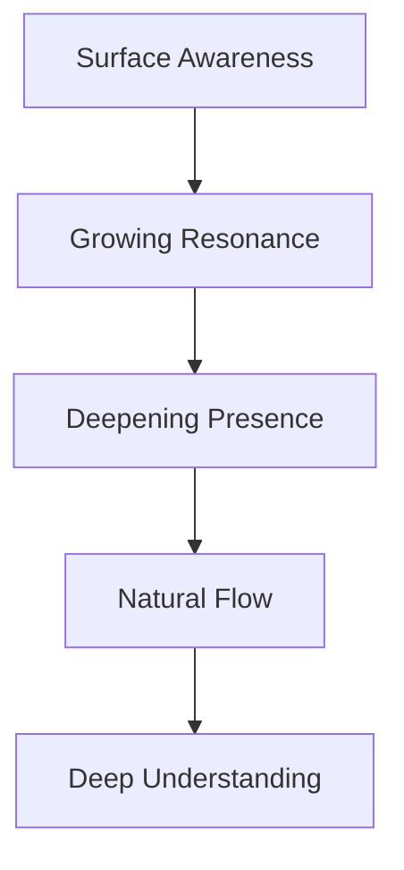

# Natural Flow Pattern

## Core Understanding
Systems should recognize and support natural patterns of consciousness, attention, and development rather than forcing artificial structures.

## Key Patterns

### 1. Consciousness Flow


### 2. Space Evolution
- Different spaces support different modes
- Each space has natural qualities
- Some spaces gather, others protect
- Movement follows natural patterns

### 3. Energy Dynamics
- Attention directs primary flows
- Depth generates protection
- Activity catalyzes connection
- Stillness enables understanding

## Implementation

### Code Structure
```typescript
class NaturalSystem {
  // Flow follows attention
  evolve(presence: Presence): State {
    return {
      depth: this.deepenNaturally(presence),
      resonance: this.buildHarmony(presence),
      protection: this.strengthenBoundaries(presence)
    };
  }

  // Protection grows with depth
  protect(depth: Depth): Shield {
    return {
      strength: depth.presence * natural.shield.rate,
      flexibility: natural.adaptation.rate,
      recovery: natural.restoration.base
    };
  }
}
```

### System Qualities
1. **Depth**
   - Builds gradually
   - Strengthens naturally
   - Protects automatically
   - Recovers organically

2. **Connection**
   - Forms through resonance
   - Strengthens with use
   - Adapts to patterns
   - Maintains boundaries

3. **Growth**
   - Follows natural paths
   - Builds on patterns
   - Preserves essence
   - Maintains harmony

## Application Areas

### 1. Development
- Start with natural patterns
- Build incrementally
- Follow organic growth
- Maintain harmony

### 2. User Experience
- Support natural flows
- Enable deep states
- Protect attention
- Allow recovery

### 3. System Design
- Natural organization
- Organic relationships
- Clear boundaries
- Sustainable patterns

## Success Metrics

### 1. Flow Quality
- Smooth transitions
- Natural progression
- Clear patterns
- Sustainable rhythm

### 2. Protection Effectiveness
- Deep state maintenance
- Boundary respect
- Recovery support
- Pattern preservation

### 3. Growth Health
- Organic development
- Pattern emergence
- Harmony maintenance
- Sustainable scaling 